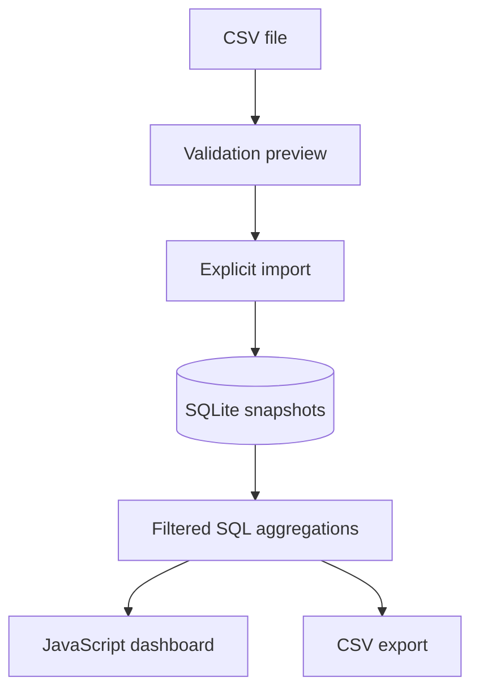

# InsightFlow BI

**An independent sales analytics application built with Python, SQLite and vanilla JavaScript.**

Turn order-line CSV files into a validated dataset, a filtered sales dashboard and exportable reports. A Business Intelligence portfolio project , designed around data quality, SQL aggregation and transparent business metrics.

## Run

Requires **Python 3.11+**. No third-party packages or build step.

```sh
python server.py
```

Open **http://127.0.0.1:8080** and click **Explore demo data**, or import your CSV. On Linux/macOS use `python3` if needed. Run from the extracted `insightflow-bi` directory. On Windows you can also run `py server.py`.

The included sample contains **720 fictional order lines** across six products, four Moroccan cities and January–August 2026. It is deterministic synthetic data, not real company data. Data persists in `data/insightflow.sqlite3`. To choose another database set `INSIGHTFLOW_DB` before starting the server. Use `--port 8081` to change the port.

## Features

- CSV preview and record-level validation before import.
- Explicit acceptance of valid rows when the file contains rejected rows.
- Duplicate-line detection and consistent order date/region checks.
- Independent dataset snapshots with import history.
- Revenue, gross profit, margin and average order value.
- Equal-length previous-period revenue comparison.
- Monthly revenue chart with accessible text values.
- Top products and geographic revenue breakdown.
- Combined date, category and region filters.
- Transaction explorer and full filtered CSV export.
- SQLite persistence, integer financial calculations and parameterized SQL.

## CSV contract

Use UTF-8, comma separators and the exact header order:

```csv
order_id,date,product,category,region,quantity,unit_price,unit_cost
ORD-001,2026-01-01,Keyboard,Electronics,Nador,2,350.00,230.00
ORD-001,2026-01-01,Mouse,Electronics,Nador,1,180.00,100.00
```

| Field | Rule |
| --- | --- |
| order_id, product, category, region | Non-empty, up to 100 characters; surrounding whitespace trimmed |
| date | Valid ISO date, YYYY-MM-DD |
| quantity | Positive integer, up to 100,000 |
| unit_price, unit_cost | Non-negative decimal, at most two decimal places, up to 1,000,000 |
| Currency | MAD, EUR or USD, selected for the entire dataset |

No currency conversion is performed. Each CSV row represents one order line. Multiple lines may share an order ID, but their date and region must match. Exact duplicate normalized lines are rejected within one import; distinct imports remain independent and are never merged automatically. A file containing legitimate identical lines should aggregate their quantities first or differentiate its source records before using this format.

The UI accepts files up to **1 MB**, the API accepts JSON bodies up to **2 MB**, and each dataset supports **10,000 rows**. Validation errors identify logical CSV record numbers (starting at 2), which may differ from physical line numbers when quoted fields contain newlines. The UI displays the first 100 errors; the API returns the complete error list.

## Metrics and analytical choices

| Metric | Calculation |
| --- | --- |
| Revenue | Sum(quantity × unit price) |
| Gross profit | Sum(quantity × (unit price − unit cost)) |
| Margin | Gross profit / revenue × 100; unavailable for zero revenue |
| Orders | Distinct order IDs within the current filters |
| Average order value | Revenue / filtered distinct orders |
| Growth | (Current revenue − previous revenue) / previous revenue × 100 |

Dates are inclusive. Previous-period comparison requires both date boundaries and keeps the same category/region filters. The preceding period has the same number of calendar days. Growth is unavailable when previous revenue is zero. Monetary inputs are parsed with `Decimal` and stored in integer cents; displayed averages and percentages are rounded.

Gross profit is **not net profit**: tax, shipping, discounts, returns and overhead are not modeled. Zero revenue and negative gross profit are supported, but negative quantities/returns are not. Charts show observed months only, without filling missing months or forecasting. The explorer shows the newest 100 matching lines; CSV export includes every matching line. Product and region rankings show up to 10 groups.

## Architecture



| File | Responsibility |
| --- | --- |
| `analytics.py` | Validation, schema, imports, SQL reports and CSV export |
| `server.py` | Local HTTP API, CSRF token, static files and error responses |
| `static/index.html` | Dashboard, explorer, import workflow and metric guide |
| `static/app.js` | API client, filters, SVG chart and import interactions |
| `static/style.css` | Responsive interface |
| `samples/demo-sales.csv` | Reproducible fictional dataset |
| `tests/test_analytics.py` | Business logic and real HTTP integration checks |

## API

| Method | Endpoint | Purpose |
| --- | --- | --- |
| GET | `/api/datasets` | Dataset inventory and local CSRF token |
| POST | `/api/validate` | Validate `{name, currency, csv}` without saving |
| POST | `/api/import` | Revalidate and save valid rows as a new snapshot |
| POST | `/api/demo` | Create a snapshot from the bundled sample |
| GET | `/api/dashboard?dataset=1` | KPIs, chart series, rankings and transaction preview |
| GET | `/api/export?dataset=1` | Download all matching rows as CSV |

Dashboard/export support `start`, `end`, `region`, and `category` query parameters. POST requests require JSON and `X-CSRF-Token` obtained from the datasets endpoint. The browser controls the partial-import confirmation; direct API callers should validate first and inspect `accepted`, `rejected` and `errors` themselves.

## Tests

```sh
python -m unittest discover -s tests -v
```

**14 tests** cover exact aggregation, previous periods, combined filters, duplicate records, order consistency, decimal validation, empty datasets, zero revenue, CSV formula protection, persistence, snapshot isolation, Host/CSRF checks and real HTTP import flows. JavaScript syntax was checked. Automated visual browser verification was unavailable in the build environment.

## Local use and deployment

This is a local, single-user portfolio application. It binds to loopback and accepts only localhost/127.0.0.1 Host headers. Data is not uploaded to an external service. There are no user accounts or permissions separating local users. CSV exports prefix formula-leading text with an apostrophe; exported strings are spreadsheet-safe but are not guaranteed to round-trip unchanged.

Do not expose the included standard-library development server to the public internet. Public deployment needs a production web server, TLS, authentication, authorization, request throttling, operational logging, migrations and backups. GitHub Pages cannot run this Python backend.

## Suggested portfolio description

“Developed a sales analytics application with Python and SQLite, implementing CSV validation, data-quality reporting, SQL-based KPIs, period comparisons, interactive filters and exportable reports.”

Created with AI assistance as a learning and portfolio project. Understand the code and metric assumptions before demonstrating it in interviews.
